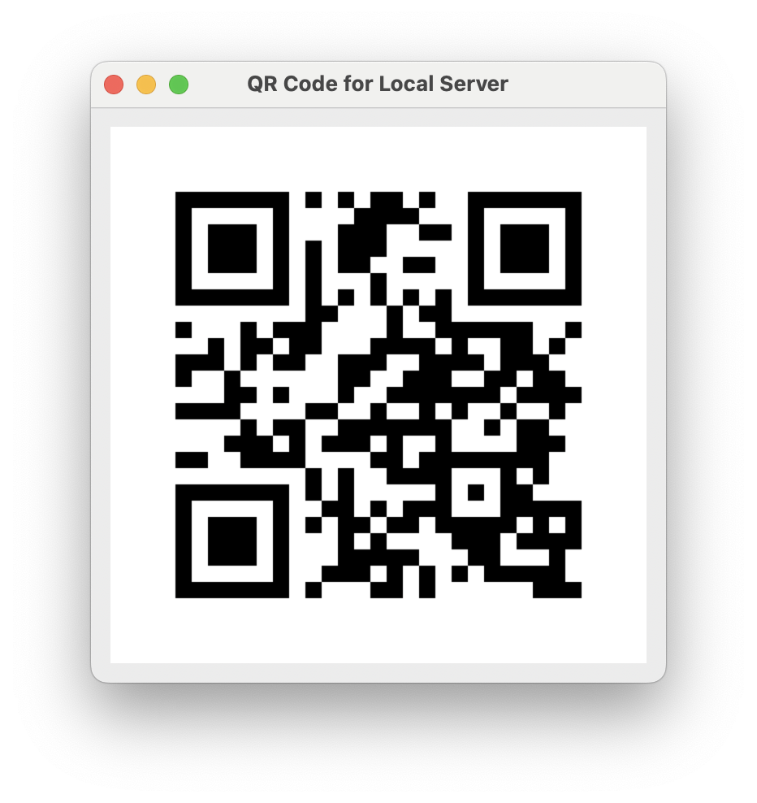

# File Share

## Description

## Installation
Install miniconda, after activating anaconda environment install the necessary packages in requirements.txt

### Prerequisites
- Latest stable Python version
 
## Features
- Sharing your files in LAN(Local Area Network)

## License
Distributed under the MIT License. See `LICENSE` for more information.
